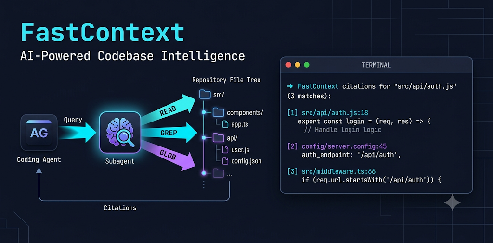

# FastContext Integrations

Your coding agent is wasting tokens. In GPT-5.4 trajectories, reading and searching
account for **56% of all tool-use turns** and **47% of the main agent's total tokens** —
just to locate the relevant code. FastContext offloads that entirely to a dedicated
subagent, so your main agent receives clean `file:line` citations instead of a long trail
of exploratory reads.

The result: **up to +5.5% accuracy and up to 60% fewer tokens** on SWE-bench benchmarks.

This repo is the MCP glue that wires FastContext into every major editor with one click.


<sub>Image created using Nano Banana</sub>

```
fastcontext_explore("where are webhook signatures verified?")
→  src/auth/webhook.py:42-61
→  config/secrets.py:18
```

Your agent reads those two ranges. Done.

## The model

FastContext-1.0 is a model family purpose-trained for repository exploration by Microsoft
Research ([arXiv:2606.14066](https://arxiv.org/abs/2606.14066)). It is **not** a general
LLM asked to search code — it is trained end-to-end on exploration trajectories using SFT
then refined with task-grounded RL (GRPO), with rewards based on file- and line-level F1.

At each turn it issues parallel **READ / GLOB / GREP** tool calls, refines based on
observations, and stops with a compact `<final_answer>` citation block. Nothing more
enters the main agent's context.

### Model family

| Variant | Backbone | Best for | HuggingFace ID |
| --- | --- | --- | --- |
| **FC-4B-SFT** | Qwen3-4B-Instruct | CPU / any GPU, turnkey | `microsoft/FastContext-1.0-4B-SFT` |
| **FC-4B-RL** | Qwen3-4B-Instruct | Best 4B quality (RL-refined) | `microsoft/FastContext-1.0-4B-RL` |
| **FC-30B-SFT** | Qwen3-Coder-30B-A3B | Max quality, GPU server | `microsoft/FastContext-1.0-30B-SFT` |
| **GGUF / MLX** | any of the above | llama.cpp / Apple Silicon | search HuggingFace for `FastContext GGUF` / `FastContext MLX` |

All variants support up to **262K token context**.

> The compact 4B-RL explorer can outperform the larger 30B-SFT — e.g. on SWE-bench Pro
> with GLM-5.1 it reaches 22.5 vs. 20.0 while using fewer tokens.

### Where to download

- **LM Studio** — search `FastContext` in the model browser. Pick FC-4B-SFT or FC-4B-RL
  for consumer hardware; use MLX builds on Apple Silicon.
- **HuggingFace** — [`microsoft/FastContext-1.0-4B-SFT`](https://huggingface.co/microsoft/FastContext-1.0-4B-SFT),
  [`microsoft/FastContext-1.0-4B-RL`](https://huggingface.co/microsoft/FastContext-1.0-4B-RL),
  [`microsoft/FastContext-1.0-30B-SFT`](https://huggingface.co/microsoft/FastContext-1.0-30B-SFT).
- **Ollama / llama.cpp** — any GGUF community conversion; search HuggingFace for `FastContext GGUF`.

Once loaded, copy the model ID exactly as shown by your runtime and paste it into `--model`.

### Why it's fast

- Small by design: a 4B model laser-focused on one task beats a 70B generalist at it.
- Parallel tool calls in a single turn: covers multiple search hypotheses at once.
- Local and private: no code leaves your machine, no API cost per search.

## Install

<!-- install buttons (regenerate with scripts/make-install-buttons.py) -->
[](https://cursor.com/install-mcp?name=fastcontext&config=eyJjb21tYW5kIjoidXZ4IiwiYXJncyI6WyItLWZyb20iLCJnaXQraHR0cHM6Ly9naXRodWIuY29tL0xJVkVMVUNLWS9mYXN0Y29udGV4dC1pbnRlZ3JhdGlvbnMiLCJmYXN0Y29udGV4dC1tY3AiLCItLWJhc2UtdXJsIiwiaHR0cDovL2xvY2FsaG9zdDoxMjM0L3YxIiwiLS1tb2RlbCIsInlvdXItbW9kZWwtaWQiLCItLWFwaS1rZXkiLCJsbS1zdHVkaW8iXX0%3D)
[](https://vscode.dev/redirect/mcp/install?name=fastcontext&config=%7B%22type%22%3A%22stdio%22%2C%22command%22%3A%22uvx%22%2C%22args%22%3A%5B%22--from%22%2C%22git%2Bhttps%3A%2F%2Fgithub.com%2FLIVELUCKY%2Ffastcontext-integrations%22%2C%22fastcontext-mcp%22%2C%22--base-url%22%2C%22http%3A%2F%2Flocalhost%3A1234%2Fv1%22%2C%22--model%22%2C%22your-model-id%22%2C%22--api-key%22%2C%22lm-studio%22%5D%7D)
[](https://insiders.vscode.dev/redirect/mcp/install?name=fastcontext&config=%7B%22type%22%3A%22stdio%22%2C%22command%22%3A%22uvx%22%2C%22args%22%3A%5B%22--from%22%2C%22git%2Bhttps%3A%2F%2Fgithub.com%2FLIVELUCKY%2Ffastcontext-integrations%22%2C%22fastcontext-mcp%22%2C%22--base-url%22%2C%22http%3A%2F%2Flocalhost%3A1234%2Fv1%22%2C%22--model%22%2C%22your-model-id%22%2C%22--api-key%22%2C%22lm-studio%22%5D%7D&quality=insiders)

**Claude Code** (no button — one command):

```bash
claude mcp add fastcontext -- uvx --from git+https://github.com/LIVELUCKY/fastcontext-integrations fastcontext-mcp \
  --base-url http://localhost:1234/v1 --model your-model-id --api-key lm-studio
```

After clicking a button or running the command, set `--model` to the exact ID your
runtime shows for the loaded model.
Using a remote API? Keep the key secure — see [`docs/SETUP.md#secure-api-keys`](docs/SETUP.md#secure-api-keys).

## Prerequisites (once)

```bash
# 1. uv (the Python tool runner)
curl -LsSf https://astral.sh/uv/install.sh | sh

# 2. the FastContext explorer CLI on your PATH
uv tool install git+https://github.com/microsoft/fastcontext

# 3. a FastContext model loaded in an OpenAI-compatible runtime
#    e.g. LM Studio: search "FastContext", download FC-4B-SFT or FC-4B-RL,
#    Developer tab → Start Server (serves http://localhost:1234/v1, no API key needed)
```

No clone, no absolute paths, no environment variables: the server runs via `uvx` straight
from this repo and takes its connection from the `--base-url` / `--model` / `--api-key`
args. Full details in [`docs/SETUP.md`](docs/SETUP.md).

## Per-editor setup

<details>
<summary><b>GitHub Copilot (VS Code)</b></summary>

Click the **Install in VS Code** button above — it registers the server directly in VS Code, which Copilot agent mode uses.
Or copy [`examples/vscode.mcp.json`](examples/vscode.mcp.json) into your project's `.vscode/mcp.json`
(top-level key is `servers`, not `mcpServers`). Enable agent mode — `fastcontext_explore` appears in the
tool picker. Add the usage guidance to `.github/copilot-instructions.md`.
</details>

<details>
<summary><b>Claude Code</b></summary>

Run the `claude mcp add` command above, or copy [`examples/claude-code.mcp.json`](examples/claude-code.mcp.json)
to your project root as `.mcp.json`. Append [`prompts/fastcontext-usage.md`](prompts/fastcontext-usage.md)
to your `CLAUDE.md`.

Prefer the upstream-style **skill** (the CLI directly, reads env vars instead of args)?
See [`examples/claude-code-skill/SKILL.md`](examples/claude-code-skill/SKILL.md).
</details>

<details>
<summary><b>OpenAI Codex CLI</b></summary>

Add [`examples/codex.config.toml`](examples/codex.config.toml) to `~/.codex/config.toml`
(header is `[mcp_servers.fastcontext]` — underscore). Append the usage guidance to your
`AGENTS.md`.
</details>

<details>
<summary><b>Cursor</b></summary>

Click **Add to Cursor** above, or copy [`examples/cursor.mcp.json`](examples/cursor.mcp.json)
into `.cursor/mcp.json`. Add the usage guidance as a `.cursor/rules/fastcontext.mdc` rule.
</details>

<details>
<summary><b>Cline</b></summary>

Merge [`examples/cline.mcp.json`](examples/cline.mcp.json) into Cline's MCP settings
(`autoApprove` is pre-set for the read-only tool).
</details>

<details>
<summary><b>Windsurf</b></summary>

Copy [`examples/windsurf.mcp.json`](examples/windsurf.mcp.json) to
`~/.codeium/windsurf/mcp_config.json` (global) or merge into your project's
`.windsurf/mcp.json` (local). The format is the same `mcpServers` object used by
Cursor and Claude Code. Add the usage guidance as a Windsurf rule.
</details>

<details>
<summary><b>Anything else (Aider, custom agents, shell-only)</b></summary>

Any MCP client: register the command
`uvx --from git+https://github.com/LIVELUCKY/fastcontext-integrations fastcontext-mcp --base-url ... --model ...`.

Any shell-capable agent without MCP: install the FastContext CLI and run
`fastcontext -q "<question>" --citation` directly (reads `BASE_URL`/`MODEL`/`API_KEY` from
the environment). Guidance: [`prompts/fastcontext-usage.md`](prompts/fastcontext-usage.md).
</details>

## Make the agent actually delegate

Add [`prompts/fastcontext-usage.md`](prompts/fastcontext-usage.md) to your agent's
instructions. Without it, agents tend to ignore the tool or re-scan the repo after calling
it — which erases the savings. ([Where it goes per client](docs/SETUP.md#teach-the-agent-to-delegate).)

## Updating

`uvx` caches the server by commit and does **not** auto-update. When a new version lands,
the server logs `update available: vX.Y.Z` on startup (visible in your client's MCP logs).
Pull it with one command:

```bash
uvx --refresh --from git+https://github.com/LIVELUCKY/fastcontext-integrations fastcontext-mcp --help
```

Then restart your client. (Or `uv cache clean fastcontext-mcp` to force a rebuild on next launch.)

## Verify

```bash
./scripts/fastcontext-check.sh /path/to/any/repo \
  --base-url http://localhost:1234/v1 --model your-model-id
```

## What's in here

```text
fastcontext_mcp.py        zero-dependency MCP server (connection via args)
pyproject.toml            makes it runnable as `uvx --from git+<repo> fastcontext-mcp`
examples/                 copy-paste config per editor (+ optional Claude skill)
prompts/                  the "when/how to delegate" usage prompt
scripts/                  make-install-buttons.py (regenerate badges), fastcontext-check.sh
docs/                     SETUP.md, TROUBLESHOOTING.md
```

## Credits & license

FastContext is by Microsoft Research, MIT-licensed
([github.com/microsoft/fastcontext](https://github.com/microsoft/fastcontext),
[arXiv:2606.14066](https://arxiv.org/abs/2606.14066)). The optional Claude skill and the
usage prompt are adapted from that repo. This integration layer is MIT-licensed (see
[`LICENSE`](LICENSE)). Not affiliated with or endorsed by Microsoft.
