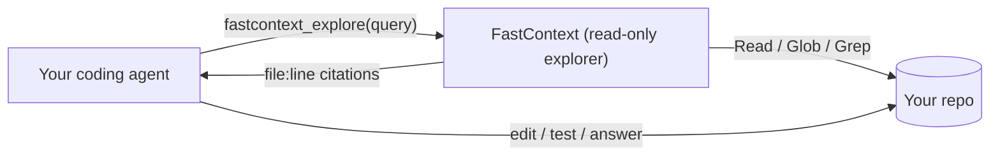

# Setup

Everything you need to get FastContext running in your coding agent.

## How it works



Your agent delegates a natural-language query to FastContext. It explores the repo with
read-only tools and returns a compact list of `file:line` citations. The broad search
never enters your main agent's context window. This repo wraps FastContext as an MCP
server (`fastcontext_explore`) so any MCP-capable agent can call it.

## Prerequisites (once)

1. **[uv](https://docs.astral.sh/uv/)** — the Python tool runner.

   ```bash
   curl -LsSf https://astral.sh/uv/install.sh | sh
   ```

2. **The FastContext explorer CLI** on your PATH (needs Python ≥ 3.12, handled by uv):

   ```bash
   uv tool install git+https://github.com/microsoft/fastcontext
   fastcontext --help   # confirm it's on PATH
   ```

   The MCP server shells out to this CLI. That's the only thing you install for the
   explorer itself — the MCP server runs via `uvx` straight from this repo (no clone).

3. **An OpenAI-compatible endpoint** (next section).

## Connect a model endpoint

FastContext talks to any OpenAI-compatible `/v1/chat/completions` endpoint you already
run. A small, fast model is ideal — exploration shouldn't burn your main model.

### LM Studio (recommended, turnkey)

1. Install LM Studio, download an instruct/coding model.
2. Developer (Local Server) tab → select the model → **Start Server** (or `lms server start`).
3. It serves `http://localhost:1234/v1`. No API key required (any string works).

```text
--base-url  http://localhost:1234/v1
--model     <the model id shown in LM Studio>
--api-key   lm-studio
```

### Other local runtimes

| Runtime | `--base-url` | `--api-key` | Notes |
| --- | --- | --- | --- |
| LM Studio | `http://localhost:1234/v1` | any string | Developer tab → Start Server |
| Ollama | `http://localhost:11434/v1` | any string | `ollama serve` |
| llama.cpp server | `http://localhost:8080/v1` | any string | `llama-server -m model.gguf` |
| vLLM | `http://localhost:8000/v1` | any string | `vllm serve <model>` |
| LiteLLM / gateway | `http://localhost:4000/v1` | your key | single proxy for many backends |

### Remote / hosted APIs

Use a fast, cheap model for exploration — this is not your main coding model.

| Provider | `--base-url` | Model example |
| --- | --- | --- |
| OpenRouter | `https://openrouter.ai/api/v1` | `qwen/qwen-2.5-coder-7b-instruct` |
| Together AI | `https://api.together.xyz/v1` | `Qwen/Qwen2.5-Coder-7B-Instruct-Turbo` |
| Groq | `https://api.groq.com/openai/v1` | `llama-3.1-8b-instant` |
| Fireworks AI | `https://api.fireworks.ai/inference/v1` | `accounts/fireworks/models/qwen2p5-coder-7b-instruct` |
| Any OpenAI-compatible | provider's `/v1` | see provider docs |

> For hosted APIs, **keep the key secure** — see [Secure API keys](#secure-api-keys) below.

## Secure API keys

For local servers (LM Studio, Ollama) `--api-key` is ignored — any string works.
For remote APIs, the key must stay out of plaintext config files and shell history.

### Preferred: inject via client `env` field

All MCP clients accept an `env` object that passes environment variables to the server
process. Set the key there instead of in `args` — it never appears in `ps aux` or git
history, and the server reads it automatically from `FASTCONTEXT_API_KEY`.

**VS Code** (`.vscode/mcp.json`) — supports `${env:VAR}` expansion at server start:

```json
{
  "servers": {
    "fastcontext": {
      "type": "stdio",
      "command": "uvx",
      "args": ["--from", "git+https://github.com/LIVELUCKY/fastcontext-integrations",
               "fastcontext-mcp", "--base-url", "https://openrouter.ai/api/v1",
               "--model", "qwen/qwen-2.5-coder-7b-instruct"],
      "env": { "FASTCONTEXT_API_KEY": "${env:FASTCONTEXT_API_KEY}" }
    }
  }
}
```

**Cursor / Windsurf / Claude Code / Cline** (`.cursor/mcp.json`, `windsurf.mcp.json`, `.mcp.json`):

```json
{
  "mcpServers": {
    "fastcontext": {
      "command": "uvx",
      "args": ["--from", "git+https://github.com/LIVELUCKY/fastcontext-integrations",
               "fastcontext-mcp", "--base-url", "https://openrouter.ai/api/v1",
               "--model", "qwen/qwen-2.5-coder-7b-instruct"],
      "env": { "FASTCONTEXT_API_KEY": "sk-or-..." }
    }
  }
}
```

Then add `*.mcp.json` and `.cursor/mcp.json` to your `.gitignore` if the file contains the
literal key. Alternatively, use the `${env:VAR}` form and export the key from your shell rc.

### Shell environment fallback

Export the key from your shell profile so every terminal inherits it:

```bash
# ~/.zshrc or ~/.bashrc
export FASTCONTEXT_API_KEY=sk-or-...
```

The server checks `FASTCONTEXT_API_KEY` automatically — no `--api-key` arg needed.

### OS keychain (no plaintext anywhere)

```bash
# macOS: store once
security add-generic-password -a fastcontext -s fastcontext-api-key -w sk-or-...

# retrieve in shell rc (runs at login, not stored in rc file)
export FASTCONTEXT_API_KEY=$(security find-generic-password -a fastcontext -s fastcontext-api-key -w)
```

For 1Password CLI: `export FASTCONTEXT_API_KEY=$(op read "op://vault/item/api-key")`

## Install the server in your agent

The connection is passed as **arguments** (`--base-url` / `--model` / `--api-key`) — no
environment variables, no absolute paths. Every client runs the same command:

```bash
uvx --from git+https://github.com/LIVELUCKY/fastcontext-integrations fastcontext-mcp \
  --base-url http://localhost:1234/v1 --model your-model-id --api-key lm-studio
```

Or use the one-click buttons in the [README](../README.md) or copy-paste configs in [`examples/`](../examples/).

First launch is slower (uv builds the tiny server from git, then caches it).

## Teach the agent to delegate

Add [`prompts/fastcontext-usage.md`](../prompts/fastcontext-usage.md) to your agent's
instructions so it explores *before* editing and trusts the returned citations instead of
re-scanning. Where it goes per client:

| Client | Put the guidance in |
| --- | --- |
| Claude Code | `CLAUDE.md` |
| GitHub Copilot | `.github/copilot-instructions.md` |
| Codex CLI | `AGENTS.md` |
| Cursor | `.cursor/rules/fastcontext.mdc` |
| Cline | `.clinerules` |

## Verify

```bash
./scripts/fastcontext-check.sh /path/to/any/repo \
  --base-url http://localhost:1234/v1 --model your-model-id
```

Checks the CLI is installed, the MCP handshake works, and (with a repo + flags) runs a
real exploration. Trouble? See [TROUBLESHOOTING.md](TROUBLESHOOTING.md).
